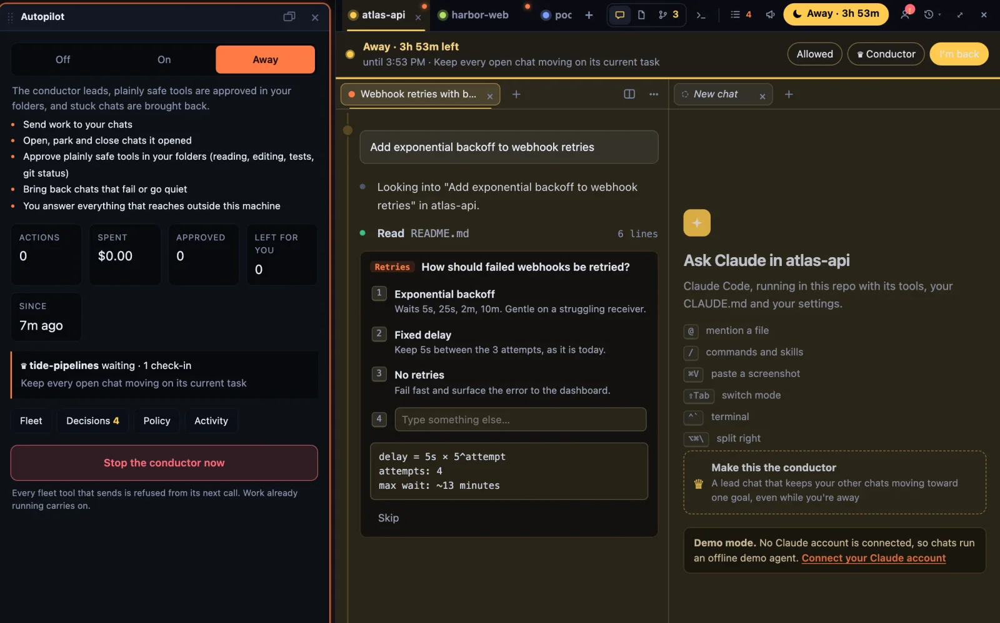
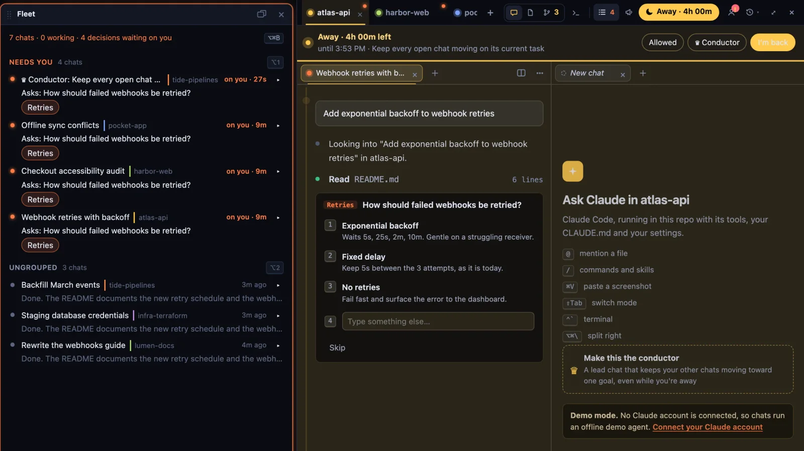
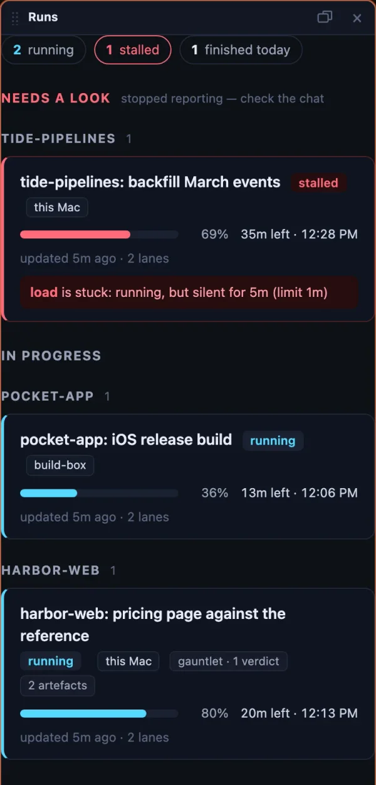
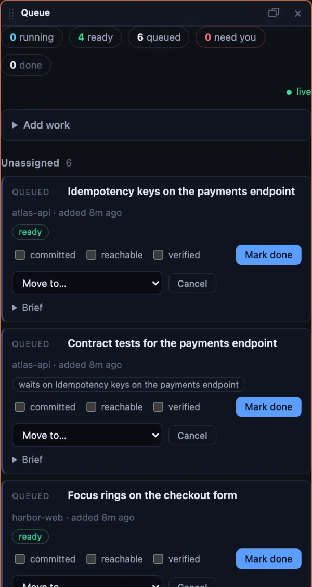

# Laika Orbit

**A cockpit for your coding agents.** Run many Claude Code chats at once. Orbit keeps them moving,
puts what needs you first, and sits beside the editor you already use. Open source, and it all runs
on your own Mac.



> **Status: macOS preview.** Built and used daily on macOS, and built with itself
> ([how](https://laikaorbit.com/built-with-orbit/)). The recall engine, CLI and MCP server run
> anywhere Node runs; the desktop app is macOS first, Linux best effort, Windows untested.

## What it does

**Give it a goal. It runs the fleet.** A conductor chat sends each of your chats its next step.
Switch to Away and it keeps them going: plainly safe steps are approved, stuck chats are brought
back, and anything that reaches outside your Mac waits for you. Come back to one summary card.
[Away mode](https://laikaorbit.com/docs/away-mode/).

**Every chat, and what each one needs.** Chats run side by side, one per task, on any of your
Claude accounts, and come back after a restart or a crash. The fleet board puts the ones waiting on
you at the top.



**Long jobs report themselves.** Builds, test runs and batch jobs share one runs page, with progress,
an ETA, and before/after compares. A job that goes quiet is flagged as stalled.

**Work that waits its turn.** A queue of next tasks that survives restarts. With autopilot on, the
next item starts by itself when a chat frees up.

<p> </p>

**Heavy work goes to your other machines.** Tests, builds and captures run on a Linux box under the
desk and the files come back ([below](#other-machines)). Windows PCs for GPU work are in testing.

**And the rest of your day in the same window:** panels you dock and lay out, a real Chromium
browser with a profile per account, inbox and calendar widgets, and a live map of everything you
know. Hidden panels stop drawing: idle, the app went from 41% of one CPU core to 11%, and to 5.5%
while you're in another window.

**Finished work folds itself into main (new).** Each chat shows its branch, its commits and its
uncommitted files. Mark a chat's work ready and the merge train lands it on your local main once the
repo's own check passes. If the check goes red, it finds which chat's work broke it, lands the rest,
and sends that chat the failing output. Pushing stays with you.

### Laika Orbit recall

Underneath is **Laika Orbit recall**, a retrieval engine that answers questions about your files
without calling a model: the exact section and the file it came from, in about a millisecond, with
97.8% fewer tokens than an agent grepping and reading whole files
([`bench/RESULTS.md`](bench/RESULTS.md)). It works in any Claude Code session on its own:

```bash
claude mcp add laikaorbit -- npx -y laikaorbit mcp
```

## Requirements

- **Node 22.18 or newer** (runs TypeScript directly) and **pnpm 10**. `mise install` sets up both.
- **macOS** for the desktop app. `pdftotext` for PDF indexing: `brew install poppler`.
- **Your own Claude account** for chats. Sign in from the Claude panel; it runs Claude Code's own
  login, and Laika Orbit never sees or stores your credentials. Until then, a demo agent runs
  offline so you can try the panel.

## Quick start

```bash
git clone https://github.com/Laika-Dynamics-Ltd/laika-orbit.git && cd laika-orbit
mise install && pnpm install

cd packages/app && node server.mjs    # the app at http://localhost:5200
pnpm shell                            # (from the root) the same app in its own window, with real browser tabs
```

The first run indexes this folder only. Add your own folders (notes, projects, documents) from
the index settings (`i`); nothing outside the repo is read until you add it.

### The engine on its own

```bash
node packages/cli/src/index.ts index                          # build the index
node packages/cli/src/index.ts recall "which TTS voice do we use"
node packages/cli/src/index.ts lint                           # router-file diagnostics
```

Claude Code picks up the MCP server from [`.mcp.json`](.mcp.json) when you open this folder.
`BRAIN_ROOT` points any of it at another corpus:

```bash
cd packages/app && BRAIN_ROOT="$HOME/Documents" PORT=5201 node server.mjs
```

## Configuration

Everything is optional. Copy [`.env.example`](.env.example) to `.env.local` for the feeds:

| | |
|---|---|
| **Calendar** | `CALENDAR_ICS_URLS`: your calendar's secret iCal address. Several: comma-separated. |
| **Inbox** | `GOOGLE_CLIENT_ID` and `GOOGLE_CLIENT_SECRET` from your own Google Cloud OAuth client, then connect from the widget. The refresh token goes in the macOS Keychain. |
| **Claude accounts** | Added from the Claude panel, listed in `brain/agents.local.json`. |
| **Connectors** | The Claude connectors your accounts have, for the settings panel and the map: `brain/connectors.local.json`, as `[{ "id", "name", "via", "live" }]`. |

Files ending `.local.json`, `.env.local`, and the settings the app writes as you use it are
gitignored, so pulling updates never conflicts with your setup.

## Privacy and security

- **Local only.** The server listens on `127.0.0.1` and refuses requests with any other `Host`,
  and cross-site requests that would change something are refused. There is no login, so don't
  expose the port.
- **What leaves your machine:** chats go to Anthropic through Claude Code under your account; the
  inbox and calendar widgets fetch from Google with the credentials you configure. After each
  chat turn a short summary is written by a small model on the same account; `LAIKA_BRIEFS=0`
  turns that off.
- **Chats ask before acting.** New chats start in Claude Code's default permission mode; you
  choose when to allow more.
- **Usage reporting is opt-in and anonymous.** Off until you turn it on, and declining never
  creates an identifier. It sends daily counts of coarse actions (`recall_run: 40`) and never a
  path, query, file, prompt, URL or IP. Turning it off destroys the id and the queue.
  [PRIVACY.md](PRIVACY.md) lists the whole payload.

Found a vulnerability? See [SECURITY.md](SECURITY.md).

## Other machines

Claude sessions and terminals can run on other machines on your network, so their builds and
tests don't load your Mac. `pnpm node:bundle` builds one archive per platform (Linux x64 and arm64
by default; `darwin-arm64` and `darwin-x64` on request) in `tools/node-bundle/dist/`. Copy one to
the machine, then `tar -xzf` it and run `./install.sh` as the user the sessions should run as. It
bundles Node and Claude Code, installs the agent host as a user service listening on loopback only,
and lets this Mac's Laika Orbit key (`~/.laika/node/`) open an SSH tunnel to it and nothing else.
See [`tools/node-bundle/README.txt`](tools/node-bundle/README.txt).

`packages/app/offload.mjs` sends a command to the least busy machine as if it ran here: it
copies the project over (rsync, without Unity's `Library`), runs the command there, streams the
output back, brings its result files home and exits with its code. For Unity,
`offload unity -- -nographics -runTests -testResults out/tests.xml` runs the project's own Unity
version and brings the results back. `offload add user@host` adds a machine, `offload machines`
shows them, `offload discover` lists the ones announcing themselves on the network.

## How recall works

Seven steps, each a pure function with its own tests, none of them a model call:

1. **`tokenise`**: lowercase, strip punctuation, drop a stop list, matched on word boundaries so
   `everyone` and `milestone` survive.
2. **`score`**: sum weights across the inverted index. No file is opened yet.
3. **`select`**: top 5 with a confidence margin; two sources come back when the result is
   ambiguous, and say so.
4. **`read`**: open only the winner.
5. **`sliceOf`**: keep the `##` section whose heading matches, or a window around the densest line.
6. **`hop`**: follow at most **one** pointer out of that slice. Hard cap, enforced by test.
7. **`buildAsk`**: question, evidence, one instruction. 9KB cap.

Recall quality is bounded by your router files, not the engine. `brain/routers/` holds typed
pointer files that act as a curated index:

```
- Skills:    script-writing — full script generation
- Files:     shared/projects/C-*/script.md — in-progress scripts
- Rules:     brain/rules/feedback_au_english.md — AU spelling always
```

Write descriptions the way a question is phrased. Pointed at a folder with no routers, recall is
a very fast filename and content search; with them, it answers.

## Packages

| | |
|---|---|
| **`core`** | The engine: indexer and the seven-step recall path. **Zero runtime dependencies.** |
| **`cli`** | `laikaorbit index · status · lint · recall · ask` |
| **`mcp`** | Three tools over stdio for Claude Code. |
| **`app`** | The Laika Orbit app: one Node server with Vite, the core API, the Claude chat host and the feeds. |
| **`shell`** | The Electron desktop app, with native browser tabs. `pnpm shell`; `pnpm shell:app` builds a macOS app into `/Applications` and adds it to the Dock. |
| **`graph`** | The renderer's scratch package. Not shipped. |
| **`tools/pulse-ingest`** | The `/pulse` ingest endpoint: a Cloudflare Worker and D1 schema. The only server-side piece, and optional. |

## Development

```bash
pnpm typecheck && pnpm test && pnpm lint      # the gates CI runs
pnpm test:e2e                                 # browser suite (npx playwright install chromium first)
node bench/scoring.bench.mjs                  # scoring throughput
node bench/token-delta.mjs                    # the token-saving claim
```

See [CONTRIBUTING.md](CONTRIBUTING.md). Plan and gates: [`PLAN.md`](PLAN.md), [`STACK.md`](STACK.md);
still open: [`BACKLOG.md`](BACKLOG.md).

## Licence

MIT © Laika Dynamics Limited. See [LICENSE](LICENSE) and
[THIRD-PARTY-NOTICES.md](THIRD-PARTY-NOTICES.md): the Chrome extension support uses a GPL-3.0
library, and chats run Anthropic's Claude Agent SDK under Anthropic's terms.

Laika Orbit runs Claude Code. It is not made by, affiliated with, or endorsed by Anthropic.
